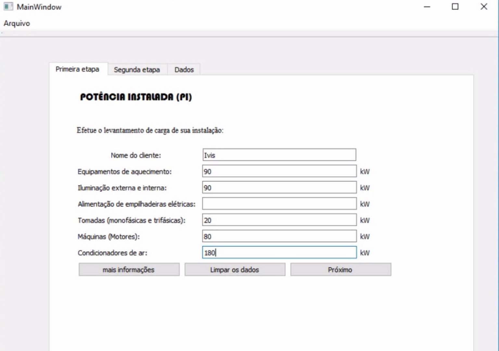
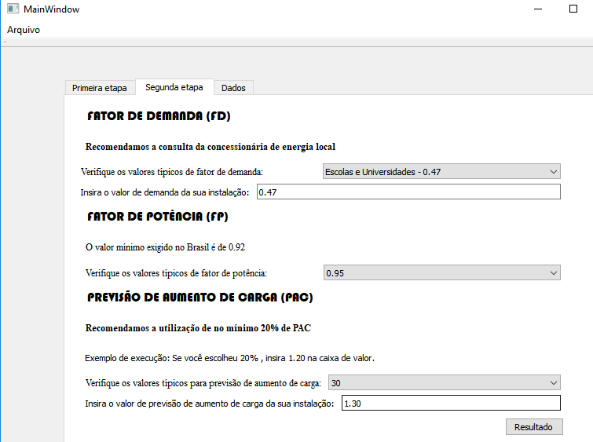
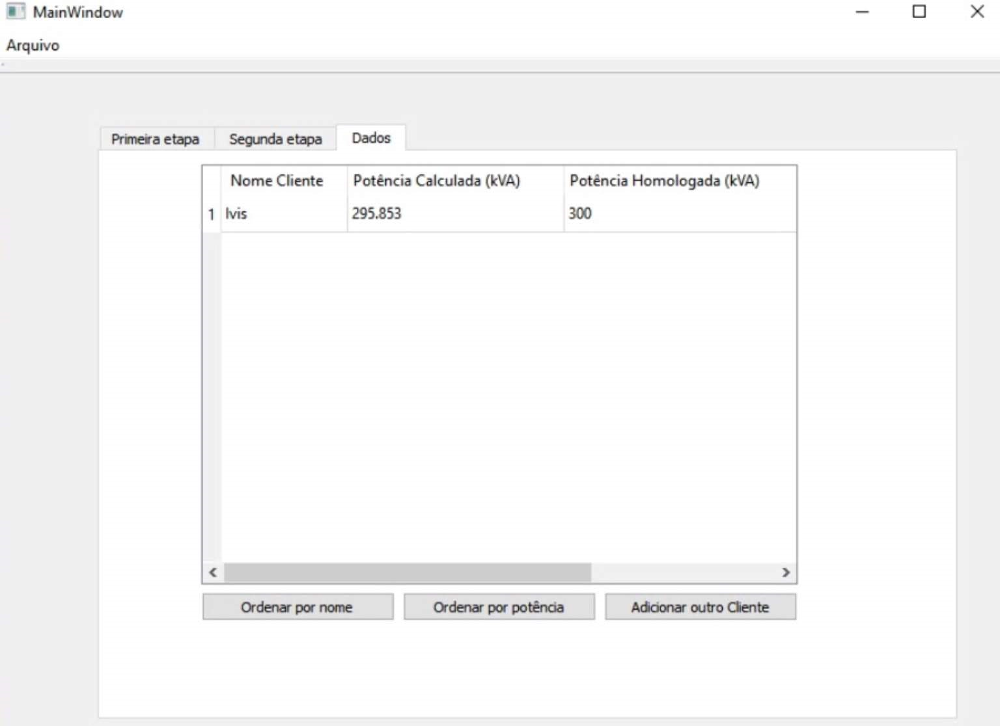
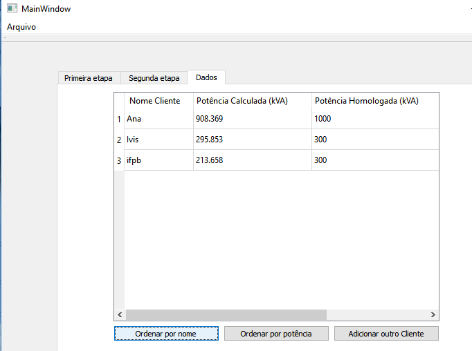
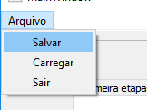
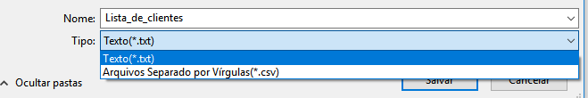
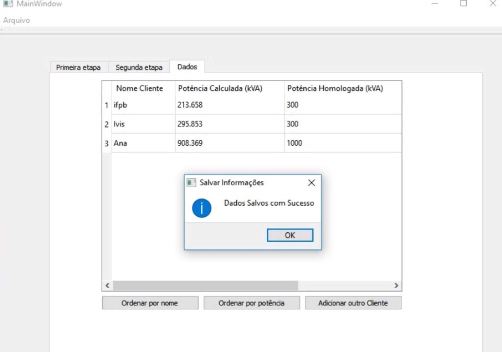
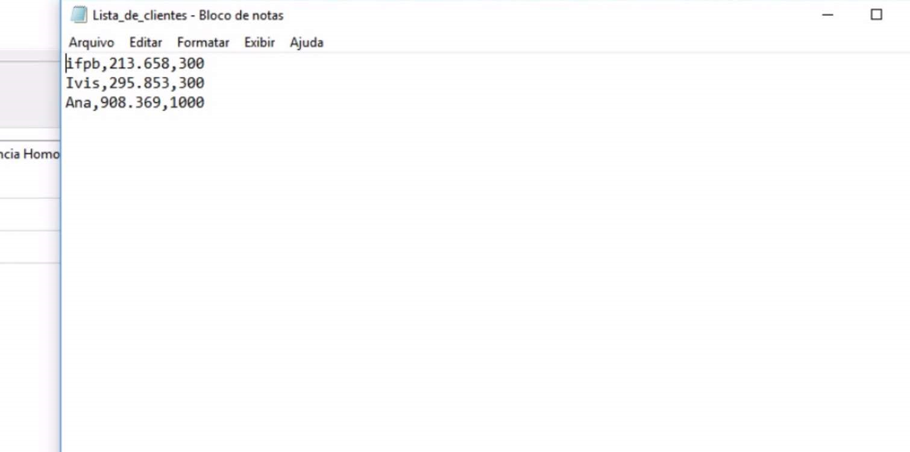
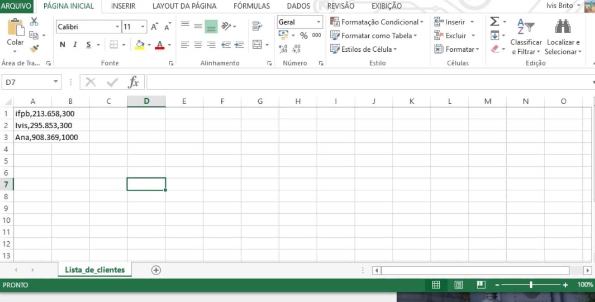

# dimensionamento_transformador
Cálculo de potência aparente nominal de transformador, registro de clientes e retorno do valor dimensionado.

A potência nominal aparente de um transformador (Sn) é um valor convencional de potência que serve como base ao projeto, ensaio e às garantias do fabricante. Através desse valor, podemos dimensionar um transformador, porém, esse processo de dimensionamento demanda de uma série de pesquisas de valores em tabelas, tornando uma tarefa exaustiva, por isso, foi desenvolvido um sistema capaz de retornar o valor da potência calculada através dos dados inseridos e retornar o valor de potência homologado pelos fabricantes de transformadores (valor encontrado no mercado para a compra do transformador). O projeto foi dividido em três etapas, a primeira foi dedicada para o usuário inserir os valores da potência nominal dos equipamentos da instalação elétrica, ou seja, potência instalada. A figura abaixo mostra a tela inicial da aplicação:

A segunda etapa foi dedicada para o usuário inserir o fator de potência (FP), fator de demandanda(FD) e a previsão de aumento de carga (PAC). De forma simplificada, o fator de potência representa o cosseno do ângulo de defasagem entre a tensão e a corrente numa carga, o fator de demanda é a relação entre a potência instalada e a potência máxima consumida pela instalação e a previsão de aumento de carga é um valor previsto para o aumento de carga da instalação. A figura abaixo mostra a segunda etapa da aplicação:

Após o usuário inserir os dados necessários e clicar no botão resultado, o sistema irá calcular o valor da potência nominal do transformador, seguindo a fórmula demostrada na figura a seguir:

Após ser realizado o cadastro das informações, o sistema irá salvar na tabela de forma imediata o nome do cliente (ou empresa), o valor de potência calculada e o valor da potência homologada pelos fabricantes, essas informações valiosas dos clientes podem ser encontradas na terceira parte do sistema, assim, como mostra figura a seguir.

Nessa etapa existe a opção de ordenar os dados em ordem alfabética ou pelo valor da potência calculada, e,  além disso, existe a opção do usuário inserir um número ilimitado de clientes, bastando, somente clicar no botão "adicionar outro cliente" . No exemplo a seguir, o usuário do sistema efetuou a ordenação de forma alfabética.

## Abrir e Salvar arquivos

O sistema de dimensionamento tem como diferencial, a opção de salvar e abrir arquivos txt e csv, dessa maneira, o sistema pode salvar todos os dados dos clientes de forma ordenada, sendo útil, pois, o usuário pode armazenar e analisar os dados acumulados diariamente.
Como podemos ver a seguir, todos os passos desse processo:

*Na opção arquivo o usuário pode salvar e carregar os dados dos seus clientes e sair do sistema.

*Nesse passo o usuário pode escolher em que tipo de arquivo ele desja salvar ou abrir no sistema.

*Quando o usuário salva ou carrega um arquivo o sistema dá o feedback para o usuário, deixando o mesmo incluso em todos os passos do sistema.

*Exemplo do arquivo salvo em txt.

*Exemplo do arquivo salvo em cvs.

*Na primeira etapa o usuário tem a opção de clicar no botão mais informações e ir direto para o site do github contendo todas as informações do projeto, além do mais, se o usuário errar os dados da primeira etapa ele tem a opção de limpar os dados clicando no botão "limpar dados" e, além disso, para o usuário ir para a segunda etapa do sistema só basta ele clicar no botão "Próximo".
